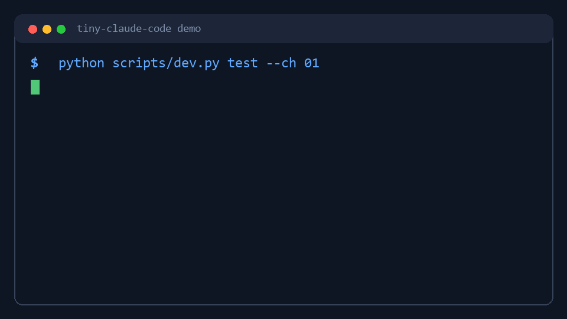

# tiny-claude-code

Build a Claude Code-style coding agent in one week.

`tiny-claude-code` is a 15-chapter Python AI coding agent tutorial for developers who want to understand how tools like Claude Code, Codex, Cursor, and other LLM coding assistants work under the hood: the agent loop, tool calling, shell commands, file access, permission checks, hooks, context compaction, memory, tasks, subagents, background jobs, and plugins.

[Documentation site](https://loveca.github.io/tiny-claude-code/) | [Quick Start](#quick-start) | [Curriculum](#curriculum)



Unlike a black-box demo, this repository gives you both:

- `src/tiny_claude_code/`: a student skeleton with TODOs
- `src/tiny_claude_code_ref/`: a complete reference implementation

You can learn chapter by chapter, run focused tests without an API key, then compare your implementation against the reference agent.

## What You Will Learn

This project is useful if you are searching for:

- how to build a coding agent from scratch
- how Claude Code-style tool calling works
- how to implement an LLM agent loop in Python
- how `tool_use` and `tool_result` messages work
- how to add shell, file, memory, hooks, subagents, and plugins to an AI coding assistant
- how to test an agent without paying for LLM API calls

## Preview

The core idea is small:

```text
messages -> LLM -> response -> tool_use -> tool_result -> messages
```

After implementing the early chapters, the agent can inspect a project through shell commands:

```text
> list the files in this repo and tell me what kind of project this is

[tool_use: bash]
command: dir

[tool_result]
exit_code: 0
stdout:
README.md
src
tests
chapters

This is a hands-on Python tutorial project for building a coding agent...
```

By the end, you will have a compact but complete agent framework with tools, safety boundaries, memory, task tracking, subagents, and extension points.

## Why This Project

Most agent tutorials stop at "call an LLM and print the answer." Real coding agents need more:

- A persistent message loop, not a one-shot prompt
- Tool schemas shown to the model and local handlers executed by the harness
- Shell and file tools that return structured observations
- Permission and hook layers around risky actions
- Context budgeting and compaction
- Session resume and project memory
- Todo tracking, subagents, background work, cron jobs, skills, and plugins

This project builds those pieces one at a time, with tests for each chapter.

## Who This Is For

- Python developers who want to build their own AI coding assistant
- LLM app builders who want a practical agent framework tutorial
- Engineers trying to understand Claude Code, Codex, Cursor-style agents, or tool calling systems
- Students who prefer small, tested chapters over a large finished framework

## Quick Start

Clone and install:

```bash
git clone git@github.com:Loveca/tiny-claude-code.git
cd tiny-claude-code
pip install -r requirements.txt
```

Run chapter tests without an API key:

```bash
python scripts/dev.py test --ch 01
python scripts/dev.py test --ch 02
python scripts/dev.py test --all
```

Run the completed reference agent:

```bash
python scripts/dev.py run --ref
```

Run your own student implementation:

```bash
python scripts/dev.py run
```

The student implementation uses `src/tiny_claude_code/`, so it will only work after you implement the required TODOs.

## Use a Real LLM

Copy the example environment file:

```bash
cp .env.example .env
```

Then set:

```env
ANTHROPIC_API_KEY=your-api-key
MODEL_ID=claude-sonnet-4-6
```

Compatible providers can be configured with `ANTHROPIC_BASE_URL` if they support the Anthropic Messages API shape used by the Anthropic SDK.

For DeepSeek:

```env
ANTHROPIC_API_KEY=your-deepseek-key
MODEL_ID=deepseek-v4-flash
# or:
# MODEL_ID=deepseek-v4-pro

# Optional: use a compatible provider (MiniMax, GLM, Kimi, DeepSeek)
ANTHROPIC_BASE_URL=https://api.deepseek.com/anthropic
```

## Curriculum

| Part | Chapters | What you build |
|------|----------|----------------|
| Part 1 | ch01-ch04 | Agent loop, shell tool, file tools, tool registry |
| Checkpoint 1 | after ch04 | Use the agent to fix a small real bug |
| Part 2 | ch05-ch07 | Permission checks, hooks, LLM error recovery |
| Part 3 | ch08-ch10 | Context budget, `/compact`, sessions, memory |
| Part 4 | ch11-ch13 | Todo system, subagents, background tasks, cron |
| Part 5 | ch14-ch15 | Real project challenge, skills, plugins |

Released chapters:

- ch01: Agent loop and CLI
- ch02: Shell tool
- ch03: File read/write/search tools
- ch04: Tool registry
- ch05: Permission system
- ch06: Hook system
- ch07: Error recovery
- ch08: Context budget
- ch09: `/compact`
- ch10: Session and memory
- ch11: Todo and task system
- ch12: Subagent delegation
- ch13: Background tasks and cron
- ch14: Real project challenge
- ch15: Skills and plugin extension

Chapter material lives in [chapters/src/](./chapters/src).

## Common Workflows

Run one chapter:

```bash
python scripts/dev.py test --ch 03
```

Check remaining TODOs:

```bash
python scripts/dev.py check
```

Compare your implementation with the reference:

```bash
diff src/tiny_claude_code/agent.py src/tiny_claude_code_ref/agent.py
```

Try the REPL commands added in later chapters:

```text
/compact
/memory add "Testing" "Run tests with pytest -q"
/memory list
/skill list
```

## Repository Layout

```text
tiny-claude-code/
  src/
    tiny_claude_code/       # student skeleton with TODOs
    tiny_claude_code_ref/   # complete reference implementation
  chapters/src/             # chapter-by-chapter tutorial material
  examples/simple-bug/      # first checkpoint exercise
  examples/buggy-python-project/
  examples/tiny-web-app/
  examples/plugins/
  examples/skills/
  tests/                    # released chapter tests
  tests_all/                # full chapter test set
  scripts/dev.py            # test/run/check helper
```

## Notes

- `python -m pytest` runs the released `tests/` suite by default.
- The student package intentionally contains TODO stubs.
- Mock LLM tests do not require an API key.
- `examples/simple-bug/`, `examples/buggy-python-project/`, and `examples/tiny-web-app/` are designed as agent practice projects.
- Runtime session and memory files are stored under `.tiny-claude-code/`.

## FAQ

### Is this a Claude Code clone?

It is not a production clone. It is a small educational implementation that rebuilds the core ideas behind a Claude Code-style coding agent: message loops, tool use, tool results, shell access, file tools, permissions, memory, subagents, and plugins.

### Do I need an Anthropic API key?

No API key is needed for chapter tests. The tests use a mock LLM client. You only need a real API key when running the interactive agent against a live model.

### Can I use this with OpenAI, DeepSeek, Kimi, GLM, or other models?

The default client uses the Anthropic SDK and Anthropic Messages API shape. Compatible providers can work through `ANTHROPIC_BASE_URL`. Providers that only expose OpenAI-compatible chat completions need a small adapter in `llm.py`.

### Why not use LangChain or another agent framework?

The goal is to learn the mechanics directly. This repository keeps the implementation small enough that you can read the code, implement each chapter, and understand where every part of the agent harness belongs.

## License

MIT
